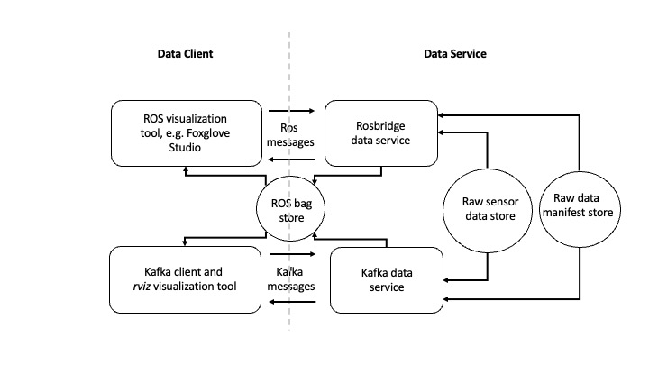

# Data Service for ADAS and ADS Development

## Overview

This is a [ROS](https://www.ros.org/) based data service for replaying dynamically selected drive scenes from a data store of multimodal data recorded from test drives undertaken to support the development of advanced driver assistance systems (ADAS), or automated driving systems (ADS). 

The data service is supported on [ROS 1 `noetic`](http://wiki.ros.org/noetic/Installation), and [ROS 2 `humble`](https://docs.ros.org/en/humble/index.html).

## Key concepts

The data service runs as [Kubernetes Deployments](https://kubernetes.io/docs/concepts/workloads/pods/) in an [Amazon EKS](https://aws.amazon.com/eks/) cluster. The service auto-scales using [Horizontal Pod Autoscaler](https://docs.aws.amazon.com/eks/latest/userguide/horizontal-pod-autoscaler.html), and [Cluster Autoscaler](https://docs.aws.amazon.com/eks/latest/userguide/cluster-autoscaler.html). 

Concretely, there are two manifestations for the data service:

1. Rosbridge data service
2. Kafka data service

### Rosbridge data service 

Rosbridge data service uses [`rosbridge`](http://wiki.ros.org/rosbridge_suite) as the communication channel. The data client connects to the data service via the `rosbridge` web-socket. The data client sends the data request for sensor data on a pre-defined ROS topic, and the data service responds by publishing the requested sensor data on the requested ROS topics. If requested, the data service can serve the response data as ROS bags.

The data client for Rosbridge data service can be any ROS visualization tool that can communicate with `rosbridge`, for example, [Foxglove Studio](https://foxglove.dev/). 

### Kafka data service

Kafka data service uses [Apache Kafka](https://kafka.apache.org/) as the communication channel. The data client sends the data request for sensor data on a pre-defined Kafka topic. The request includes the name of a Kafka response topic. The data service stages the response ROS bag(s) in the ROS bag store and responds with each ROS bag location on the Kafka response topic. 

The data client for Kafka data service is a standlone [Python application](a2d2/src/data_client.py) that runs on the desktop and is used in cojunction with [`rviz`](http://wiki.ros.org/rviz) visualization tool. The Python application plays back the response ROS bag files on the local ROS server on the desktop, and the `rviz` tool is used to visualize the playback.  

 

*High-level system architecture for the data service*

The data service runtime uses [Amazon Elastic Kubernetes Service (EKS)](https://aws.amazon.com/eks/).  Raw sensor data store and ROS bag store can be configured to use [Amazon S3](https://aws.amazon.com/s3/), [Amazon FSx for Lustre](https://aws.amazon.com/fsx/), or [Amazon Elastic File System (EFS)](https://aws.amazon.com/efs/). Raw data manifest store uses [Amazon Redshift Serverless](https://aws.amazon.com/redshift/redshift-serverless/). The data processing workflow for building and loading the raw data manifest uses [AWS Batch](https://aws.amazon.com/batch/) with [Amazon Fargate](https://aws.amazon.com/fargate/), [AWS Step Functions](https://aws.amazon.com/step-functions/), and [Amazon Glue](https://aws.amazon.com/glue/). [Amazon Managed Streaming for Apache Kafka (MSK)](https://aws.amazon.com/msk/) provides the communication channel for the Kafka data service. 

While the tutorial below walks-through both the Kafka data service and the Rosbridge service, you may choose to disable the Kafka data service, and only use the Rosbridge service, because the Rosbridge service feature set is a super set of the Kafka data service.

### Data request for sensor data

Concretely, imagine the data client wants to request drive scene  data from [A2D2 autonomous driving dataset](https://www.a2d2.audi/a2d2/en.html) for vehicle id `a2d2`, drive scene id `20190401145936`, starting at timestamp `1554121593909500` (microseconds) , and stopping at timestamp `1554122334971448` (microseconds). The data client wants the response to include data **only** from the `front-left camera` in `sensor_msgs/Image` ROS data type, and the `front-left lidar` in `sensor_msgs/PointCloud2` ROS data type. The data client wants the response data to be staged on Amazon FSx for Lustre file system, partitioned across multiple ROS bag files. Such a data request can be encoded in a JSON object, as shown below:

	{
		"vehicle_id": "a2d2",
		"scene_id": "20190401145936",
		"sensor_id": ["lidar/front_left", "camera/front_left"],
		"start_ts": 1554121593909500, 
		"stop_ts": 1554122334971448,
		"ros_topic": {"lidar/front_left": "/a2d2/lidar/front_left", 
				"camera/front_left": "/a2d2/camera/front_left"},
		"data_type": {"lidar/front_left": "sensor_msgs/PointCloud2",
				"camera/front_left": "sensor_msgs/Image"},
		"step": 1000000,
		"accept": "fsx/multipart/rosbag",
		"preview": false,
		...
	}

The `sensor_id` values are keys in `ros_topic` and `data_type` maps that map the sensors to ROS topics, and ROS data types, respectively. For a detailed description of each request field shown in the example above, see [data request fields](#RequestFields).

## Tutorial step by step guide

### Overview
In this tutorial, we use [A2D2 autonomous driving dataset](https://www.a2d2.audi/a2d2/en.html). The high-level outline of this tutorial is as follows:

* Prerequisites
* Configure the data service
* Extract and load the raw data, and the manifest
* Run the data service
* Run the data service client

### Prerequisites
This tutorial assumes you have an [AWS Account](https://aws.amazon.com/account/), and you have [Administrator job function](https://docs.aws.amazon.com/IAM/latest/UserGuide/access_policies_job-functions.html) access to the AWS Management Console.

To get started:

* Select your [AWS Region](https://docs.aws.amazon.com/AWSEC2/latest/UserGuide/using-regions-availability-zones.html). The AWS Regions supported by this project include, us-east-1, us-east-2, us-west-2, eu-west-1, eu-central-1, ap-southeast-1, ap-southeast-2, ap-northeast-1, ap-northeast-2, and ap-south-1. The [A2D2](https://registry.opendata.aws/aev-a2d2/) dataset used in this tutorial is stored in  `eu-central-1`.
* Subscribe to [Ubuntu Pro 22.04 LTS](https://aws.amazon.com/marketplace/pp/prodview-uy7jg4dds3qjw) and [Ubuntu Pro 20.04 LTS](https://aws.amazon.com/marketplace/pp/prodview-zvdilnwnuopoo).
* If you do not already have an Amazon EC2 key pair, [create a new Amazon EC2 key pair](https://docs.aws.amazon.com/AWSEC2/latest/UserGuide/ec2-key-pairs.html#prepare-key-pair). You need the key pair name to specify the `KeyName` parameter when creating the AWS CloudFormation stack below. 
* You need an [Amazon S3](https://aws.amazon.com/s3/) bucket. If you don't have one, [create a new Amazon S3 bucket](https://docs.aws.amazon.com/AmazonS3/latest/userguide/create-bucket-overview.html) in the selected AWS region. You  use the S3 bucket name to specify the `S3Bucket` parameter in the stack. The bucket is used to store the [A2D2](https://www.a2d2.audi/a2d2/en.html) data.
* Use the [public internet address](http://checkip.amazonaws.com/) of your laptop as the base value for the [CIDR](https://docs.aws.amazon.com/vpc/latest/userguide/VPC_SecurityGroups.html) to specify `DesktopRemoteAccessCIDR` parameter in the CloudFormation stack you create below.  
* For all passwords used in this tutorial, we recommend using *strong* passwords using the best-practices recommended for [AWS root account user password](https://docs.aws.amazon.com/IAM/latest/UserGuide/id_credentials_passwords_change-root.html).

### Configure the data service

#### Create AWS CloudFormation Stack
The [AWS CloudFormation](https://docs.aws.amazon.com/AWSCloudFormation/latest/UserGuide/Welcome.html) template `cfn/mozart.yml` in this repository creates [AWS Identity and Access Management (IAM)](https://aws.amazon.com/iam/) resources, so when you [create the CloudFormation Stack using the console](https://docs.aws.amazon.com/AWSCloudFormation/latest/UserGuide/cfn-console-create-stack.html), in the **Review** step, you must check 
**I acknowledge that AWS CloudFormation might create IAM resources.** 

Create a new AWS CloudFormation stack using the `cfn/mozart.yml` template. The stack input parameters you must specify are described below:

| Parameter Name | Parameter Description |
| --- | ----------- |
| KeyPairName | This is a *required* parameter whereby you select the Amazon EC2 key pair name used for SSH access to the desktop. You must have access to the selected key pair's private key to connect to your desktop. |
| RedshiftMasterUserPassword | This is a *required* parameter whereby you specify the Redshift database master user password.|
| DesktopRemoteAccessCIDR | This is a *required* parameter whereby you specify the public IP CIDR range from where you need remote access to your graphics desktop, e.g. 1.2.3.4/32, or 7.8.0.0/16. |
| DesktopInstanceType | This is a required parameter whereby you select an Amazon EC2 instance type for the ROS desktop. The default value, `g4dn.xlarge`, may not be available for your selected region, in which case, we recommend you try  one of the other available instance types.
| S3Bucket | This is a *required* parameter whereby you specify the name of the Amazon S3 bucket to store your data. **The S3 bucket must already exist.** |

For all other stack input parameters, default values are recommended during first walkthrough. See complete list of all the [template input parameters](#InputParams) below. 

#### Key AWS resources

The key resources in the CloudFormation stack are listed below:

* A ROS desktop EC2 instance (default type `g4dn.xlarge`)
* An Amazon EKS cluster with 2 [managed node group](https://docs.aws.amazon.com/eks/latest/userguide/managed-node-groups.html) nodes (default type `m5n.8xlarge`)
* An Amazon [MSK](https://aws.amazon.com/msk/) cluster with 3 broker nodes (default type `kafka.m5.large`)
* Amazon [Redshift Serverless](https://aws.amazon.com/redshift/redshift-serverless/) workgroup and namespace
* An Amazon [Fsx for Lustre](https://aws.amazon.com/fsx/lustre/) file system (default size 7,200  GiB)
* An Amazon [EFS](https://aws.amazon.com/efs/) file system

#### Connect to the graphics desktop using SSH

* Once the stack status in CloudFormation console is `CREATE_COMPLETE`, find the desktop instance launched in your stack in the Amazon EC2 console, and [connect to the instance using SSH](https://docs.aws.amazon.com/AWSEC2/latest/UserGuide/AccessingInstancesLinux.html) as user `ubuntu`, using your SSH key pair.
* When you connect to the desktop using SSH, and you see the message `"Cloud init in progress. Machine will REBOOT after cloud init is complete!!"`, disconnect and try later after about 20 minutes. The desktop installs the NICE DCV server on first-time startup, and reboots after the install is complete.
* If you see the message `NICE DCV server is enabled!`, run the command `sudo passwd ubuntu` to set a new password for user `ubuntu`. Now you are ready to connect to the desktop using the [NICE DCV client](https://docs.aws.amazon.com/dcv/latest/userguide/client.html)

#### Connect to the graphics desktop using NICE DCV Client
* Download and install the [NICE DCV client](https://docs.aws.amazon.com/dcv/latest/userguide/client.html) on your laptop.
* Use the NICE DCV Client to login to the desktop as user `ubuntu`
* When you first login to the desktop using the NICE DCV client, you are asked if you would like to upgrade the OS version. **Do not upgrade the OS version**.

Now you are ready to proceed with the following steps. For all the commands in this tutorial, we assume the *working directory* to be ` ~/amazon-eks-autonomous-driving-data-service` on the graphics desktop. 

#### Configure EKS cluster access

In this step, you need [AWS credentials](https://docs.aws.amazon.com/general/latest/gr/aws-sec-cred-types.html) for *programmatic* access for the IAM user, or role, you used to create the AWS CloudFormation stack above. You must not use the AWS credentials for a different IAM user, or role. The AWS credentials are used one-time to enable EKS cluster access from the ROS desktop, and are *automatically* *removed* at the end of this step. 

If you used an IAM role to create the CloudFormation stack above, you must manually configure the credentials associated with the IAM role in the `~/.aws/credentials` file with the following fields:

		aws_access_key_id=
		aws_secret_access_key=
		aws_session_token=

If you used an IAM user to create the stack, you do not have to manually configure the credentials in `~/.aws/credentials` file. 

In the *working directory*, run the command:

		./scripts/configure-eks-auth.sh

At the successful execution of this command, you *must* see `AWS Credentials Removed`.

#### Setup EKS cluster environment

To setup the eks cluster environment, in the *working directory*, run the command:

		./scripts/setup-dev.sh

This step also builds and pushes the data service container image into [Amazon ECR](https://aws.amazon.com/ecr/).

### Extract and load the raw data, and the manifest

In this tutorial, we use [A2D2 autonomous driving dataset](https://www.a2d2.audi/a2d2/en.html) dataset. This dataset is stored in compressed TAR format in `aev-autonomous-driving-dataset` S3 bucket in `eu-central-1`. We need to extract the A2D2 dataset into the S3 bucket for your stack, build the raw data manifest, and load the manifest into the raw data manifest store. To execute these steps, we use an [AWS Step Functions](https://docs.aws.amazon.com/step-functions/latest/dg/welcome.html) state machine. To run the AWS Step Functions state machine, execute the following command in the *working directory*:

		./scripts/a2d2-etl-steps.sh

If you have already run this script before in another CloudFormation stack that uses the same Amazon S3 bucket as your current stack, you can  skip the extraction of raw A2D2 dataset by running the following alternate command:

		./scripts/a2d2-etl-steps-skip-raw.sh
		
Note the `executionArn` of the state machine execution in the output of the previous command. To check the status the status of the execution, use following command, replacing `executionArn` below with your value:

		aws stepfunctions describe-execution --execution-arn executionArn

The time for this step depends on many variable factors, including the choice of your AWS region, and may take anywhere from 12 - 24 hours, or possibly longer.  The AWS Region `eu-central-1` takes the least amount of time for this step because the A2D2 data set is located in this region. 

### Run Kafka data service

The `a2d2-data-service` uses Kafka and is deployed using an [Helm Chart](https://helm.sh/docs/topics/charts/). To deploy the `a2d2-data-service`, execute the following command in the *working directory*:

		helm install --debug a2d2-data-service ./a2d2/charts/a2d2-data-service/

To verify that the `a2d2-data-service` deployment is running, execute the command:

		kubectl get pods -n a2d2

The data service can be configured to use S3, FSx for Lustre, or EFS (see [Preload A2D2 data from S3 to EFS](#PreloadEFS) ) as the raw sensor data store. The default raw data store is `fsx`, if FSx for Lustre is enabled (see [`FSxForLustre`](#InputParams) parameter), else it is `s3`.

Below is the Helm chart configuration for various raw data store options, with recommended Kubernetes resource requests for pod `memory` and `cpu`. This configuration is used in [`a2d2/charts/a2d2-data-service/values.yaml`](a2d2/charts/a2d2-data-service/values.yaml):

 Data source input | `values.yaml` Configuration |
| --- | ----------- |
| `fsx` (default) | `a2d2.requests.memory: "72Gi"`   `a2d2.requests.cpu: "8000m"`   `configMap.data_store.input: "fsx"`|
| `efs`  | `a2d2.requests.memory: "32Gi"`   `a2d2.requests.cpu: "1000m"`   `configMap.data_store.input: "efs"`|
| `s3`  | `a2d2.requests.memory: "8Gi"`   `a2d2.requests.cpu: "1000m"`   `configMap.data_store.input: "s3"`|

For matching data staging options in data client request, see `request.accept` field in [data request fields](#RequestFields). 

### Run Kafka data client

To visualize the response data, we use [rviz](http://wiki.ros.org/rviz) tool on the graphics desktop. Open a terminal on the desktop, and run `rviz` (`rviz2` for ROS 2). 

In the `rviz` tool, use **File>Open Config** to select  `/home/ubuntu/amazon-eks-autonomous-driving-data-service/a2d2/config/a2d2.rviz` (`.../rviz2/a2d2.rviz` for ROS 2) as the `rviz` configuration. You should see `rviz` tool configured with two windows for visualizing response data: image data on the left, and point cloud data on the right. This `rviz` configuration is specific to the examples we run below.
  
To run the Kafka data client with an example data request, execute the following command in the *working directory*:

		python ./a2d2/src/data_client --config ./a2d2/config/c-config-ex1.json

After a brief delay, you should be able to *preview* the response data in the `rviz` tool.

To *preview* data from a different drive scene, execute:

		python ./a2d2/src/data_client.py --config ./a2d2/config/c-config-ex2.json 

 You can set `"preview": false` in the data client config files, and run the above commands again to view the complete response. 

 The data client exits automatically at the end of each successful run. You can use CTRL+C to exit the data client manaually.

 When you are done with the Kafka data service, stop it by executing the command:

		helm delete a2d2-data-service

### Run Rosbridge data service

To deploy the `a2d2-rosbridge` data service, execute the following command in the *working directory*:

		helm install --debug a2d2-rosbridge ./a2d2/charts/a2d2-rosbridge/

To verify that the `a2d2-rosbridge` deployment is running, execute the command:

		kubectl get pods -n a2d2

This service provides a `Kubernetes service` for data client connection. To find the DNS endpoint for the service, execute the command:

		kubectl get svc -n a2d2

The sevice takes approximately 5 minutes to be ready after it is started, so you may not be able to connect to the service right away.

The raw data store for `a2d2-rosbridge` can be configured in [`a2d2/charts/a2d2-rosbridge/values.yaml`](a2d2/charts/a2d2-rosbridge/values.yaml). The default raw data store is `fsx`.

### Run Rosbridge data client

To publish data requests and visualize the response data, we recommend [Foxglove Studio](https://foxglove.dev/) visualization tool, which is pre-installed on the desktop client. 

First, you must connect Foxglove Studio to your Rosbridge service, and once connected, you are ready to publish data requests. A data request must be published on the pre-defined ROS topic `/mozart/data_request`. An example data request (the quotes are escaped because the `data` field value must be a string) is shown below:

	{
	    "data": "{\"vehicle_id\": \"a2d2\", \"scene_id\": \"20190401121727\", \"sensor_id\": [\"bus\", \"lidar/front_left\", \"camera/front_left\"], \"start_ts\": 1554115565612291, \"stop_ts\": 1554115765612291, \"ros_topic\": {\"bus\": \"/a2d2/bus\", \"lidar/front_left\": \"/a2d2/lidar/front_left\", \"camera/front_left\": \"/a2d2/camera/front_left\"}, \"data_type\": {\"bus\": \"a2d2_msgs/Bus\", \"lidar/front_left\": \"sensor_msgs/PointCloud2\", \"camera/front_left\": \"sensor_msgs/Image\"}, \"step\": 1000000, \"accept\": \"rosmsg\", \"preview\": false }"
	}

Notice the `accept` field is set to `rosmsg`, which means the data for each requested sensor is directly published on its mapped ROS topic specified in the `ros_topic` map field. More example data requests can be found under `a2d2/config/rosbridge/mozart/data_request/` folder.

You can exercise *control* on a running data request by publishing ROS messages on the pre-defined ROS topic `/mozart/data_request/control`. For example, to *pause* the request, you can publish:

	{ "data": "{ \"command\": \"pause\" }" }

To *resume* the request, you can publish:

	{ "data": "{ \"command\": \"play\" }" }

To *stop* the request, you can publish:

	{ "data": "{ \"command\": \"stop\" }" }

When you are done with the Rosbridge data service, stop it by executing the command:

		helm delete a2d2-rosbridge

## Deleting the AWS CloudFormation stack

When you no longer need the data service, you may delete the AWS CloudFormation stack from the AWS CloudFormation console. Deleting the CloudFormation stack deletes all the resources in the stack (including FSx for Lustre and EFS), *except for the Amazon S3 bucket*.

##  Reference

###  Data client request fields
Below, we explain the semantics of the various fields in the data client request JSON object.

| Request field name | Request field description |
| --- | ----------- |
| `servers` | The `servers` identify the [AWS MSK](https://aws.amazon.com/msk/) Kafka cluster endpoint. |
| `delay` | The `delay` specifies the delay in seconds that the data client delays sending the request. Default value is `0`. |
| `use_time` | (Optional) The `use_time` specifies whether to use the `received`  time, or `header` time when playing back the received messages. Default value is `received`. |
| `requests`| The JSON document sent by the client to the data service must include an array of one or more data `request` objects. |
| `request.kafka_topic` | For Kafka data service only. The `kafka_topic` specifies the Kafka topic on which the data request is sent from the client to the Kafka data service. |
| `request.vehicle_id` | The `vehicle_id` is used to identify the relevant drive scene dataset. |
| `request.scene_id`  | The `scene_id` identifies the drive scene of interest, which in this example is `20190401145936`, which in this example is a string representing the date and time of the drive scene, but in general could be any unique value. |
| `request.start_ts` | The `start_ts` (microseconds) specifies the start timestamp for the drive scene data request. |
| `request.stop_ts` | The `stop_ts` (microseconds) specifies the stop timestamp for the drive scene data request. |
| `request.ros_topic` | The `ros_topic` is a map from `sensor ids` in the vehicle to ROS topics.|
| `request.data_type`| The `data_type` is a map from `sensor ids` to ROS data types.  |
| `request.step` | The `step` is the discreet time interval (microseconds) used to discretize the timespan between `start_ts` and `stop_ts`. If `request.accept` value contains `multipart`, the data service responds with a  ROS bag for each discreet `step`: See [possible values](#AcceptValues) below. |
| `request.accept` | The `accept` specifies the response data staging format acceptable to the client: See [possible values](#AcceptValues) below. |
| `request.image` | (Optional) The value `undistorted` undistorts the camera image. Undistoring an image slows down the image frame rate. Default value is `original` distorted image.|
| `request.lidar_view` | (Optional) The value `vehicle` transforms lidar points to `vehicle` frame of reference view. Default value is `camera`.|
|`request.preview`| If the `preview` field is set to `true`, the data service returns requested data over a single time `step` starting from `start_ts` , and ignores the `stop_ts`.|
|`request.no_playback`| (Optional) This only applies to Kafka data client. If the `no_playback` field is set to `true`, the data client *does not playback* the response ROS bags. Default value is `false`.|
|`request.storage_id`| For ROS2 only. The storage id of `rosbag2` storage plugin. The default value is `mcap`. (See [rosbag2_storage_mcap](https://github.com/ros-tooling/rosbag2_storage_mcap) )|
|`request.storage_preset_profile`| For ROS2 only. The storage preset profile of `rosbag2` storage plugin. The default value is `zstd_fast`. (See [rosbag2_storage_mcap](https://github.com/ros-tooling/rosbag2_storage_mcap) )|

####   Possible `request.accept` field values

Rosbridge data service publishes response data on ROS topic `/mozart/data_response` for all values of `request.accept` shown below, except `rosmsg`. 

| `request.accept` value| Description |
| ---------------------------| ----------- |
| `rosmsg`               | For Rosbridge data service only. Publish response data on the requested ROS topics.|
| `fsx/multipart/rosbag` | Stage response data on Amazon FSx for Lustre in multiple ROS bags. |
| `efs/multipart/rosbag` | Stage response data on Amazon EFS in multiple ROS bags. |
|`s3/multipart/rosbag`   | Stage response data on Amazon S3 in multiple ROS bags. |
| `fsx/singlepart/rosbag`| Stage response data on Amazon FSx for Lustre in a single ROS bag. |
| `efs/singlepart/rosbag`| Stage response data on Amazon EFS in a single ROS bag. |
|`s3/singlepart/rosbag`  | Stage response data on Amazon S3 in a single ROS bag. |
| `manifest`             | Respond with a manifest of S3 paths to raw data. |

###  AWS CloudFormation template input parameters
This repository provides an [AWS CloudFormation](https://aws.amazon.com/cloudformation/) template that is used to create the required stack.

Below, we describe the AWS CloudFormation [template](cfn/mozart.yml) input parameters. Desktop below refers to the NICE DCV enabled high-performance graphics desktop that acts as the data service client in this tutorial.

| Parameter Name | Parameter Description |
| --- | ----------- |
| DesktopInstanceType | This is a **required** parameter whereby you select an Amazon EC2 instance type for the desktop running in AWS cloud. Default value is `g3s.xlarge`. |
| DesktopEbsVolumeSize | This is a **required** parameter whereby you specify the size of the root EBS volume (default size is 200 GB) on the desktop. Typically, the default size is sufficient.|
| DesktopEbsVolumeType | This is a **required** parameter whereby you select the [EBS volume type](https://docs.aws.amazon.com/AWSEC2/latest/UserGuide/ebs-volume-types.html) (default is gp3). |
| DesktopHasPublicIpAddress | This is a **required** parameter whereby you select whether a Public Ip Address be associated with the Desktop.  Default value is `true`.|
| DesktopRemoteAccessCIDR | This parameter specifies the public IP CIDR range from where you need remote access to your client desktop, e.g. 1.2.3.4/32, or 7.8.0.0/16. |
| DesktopType | This parameter specifies support for `Graphical` desktop with NICE-DCV server enabled, or `Headless` desktop with NICE-DCV server disabled. Default value is `Graphical`.|
| DataClientType | This parameter specifies support for `KafkaAndRosBridge`, or `RosBridge` only. Default value is `KafkaAndRosBridge`.|
| EKSEncryptSecrets | This is a **required** parameter whereby you select if encryption of EKS secrets is `Enabled`. Default value is `Enabled`.|
| EKSEncryptSecretsKmsKeyArn | This is an *optional* advanced parameter whereby you specify the [AWS KMS](https://aws.amazon.com/kms/) key ARN that is used to encrypt EKS secrets. Leave blank to create a new KMS key.|
| EKSNodeGroupInstanceType | This is a **required** parameter whereby you select EKS Node group EC2 instance type. Default value is `r5n.8xlarge`.|
| EKSNodeVolumeSizeGiB | This is a **required** parameter whereby you specify EKS Node group instance EBS volume size. Default value is 200 GiB.|
| EKSNodeGroupMinSize | This is a **required** parameter whereby you specify EKS Node group minimum size. Default value is 1 node.|
| EKSNodeGroupMaxSize | This is a **required** parameter whereby you specify EKS Node group maximum size. Default value is 8 nodes.|
| EKSNodeGroupDesiredSize | This is a **required** parameter whereby you specify EKS Node group initial desired size. Default value is 2 nodes.|
| FargateComputeType | This is a **required** parameter whereby you specify Fargate compute environment type. Allowed values are `FARGATE_SPOT` and `FARGATE`. Default value is `FARGATE_SPOT`. |
| FargateComputeMax | This is a **required** parameter whereby you specify maximum size of Fargate compute environment in vCpus. Default value is `1024`.|
| FSxForLustre |  This is a **required** parameter whereby you specify whether FSx for Lustre is `enabled`, or `disabled`. Default value is `enabled`.|
| FSxStorageCapacityGiB |  This is a **required** parameter whereby you specify the FSx Storage capacity, which must be in multiples of `2400 GiB`. Default value is `7200 GiB`.|
| FSxS3ImportPrefix | This is an *optional* advanced parameter whereby you specify FSx S3 bucket path prefix for importing data from S3 bucket. Leave blank to import the complete bucket.|
| KeyPairName | This is a **required** parameter whereby you select the Amazon EC2 key pair name used for SSH access to the desktop. You must have access to the selected key pair's private key to connect to your desktop. |
| KubectlVersion | This is a **required** parameter whereby you specify EKS `kubectl` version. Default value is `1.21.2/2021-07-05`. |
| KubernetesVersion | This is a **required** parameter whereby you specify EKS cluster version. Default value is `1.21`. |
| MSKBrokerNodeType | This is a **required** parameter whereby you specify the type of node to be provisioned for AWS MSK Broker. |
| MSKNumberOfNodes | This is a **required** parameter whereby you specify the number of MSK Broker nodes, which must be >= 2. |
| PrivateSubnet1CIDR | This is a **required** parameter whereby you specify the Private Subnet1 CIDR in Vpc CIDR. Default value is `172.30.64.0/18`.|
| PrivateSubnet2CIDR | This is a **required** parameter whereby you specify the Private Subnet2 CIDR in Vpc CIDR. Default value is `172.30.128.0/18`.|
| PrivateSubnet3CIDR | This is a **required** parameter whereby you specify the Private Subnet3 CIDR in Vpc CIDR. Default value is `172.30.192.0/18`.|
| PublicSubnet1CIDR | This is a **required** parameter whereby you specify the Public Subnet1 CIDR  in Vpc CIDR. Default value is `172.30.0.0/24`.|
| PublicSubnet2CIDR | This is a **required** parameter whereby you specify the Public Subnet2 CIDR  in Vpc CIDR. Default value is `172.30.1.0/24`.|
| PublicSubnet3CIDR | This is a **required** parameter whereby you specify the Public Subnet3 CIDR  in Vpc CIDR. Default value is `172.30.2.0/24`.|
| RedshiftNamespace | This is a **required** parameter whereby you specify the Redshift Serverless namespace. Default value is `mozart`.|
| RedshiftWorkgroup | This is a **required** parameter whereby you specify the Redshift Serverless workgroup. Default value is `mozart`.|
| RedshiftServerlessBaseCapacity | This is a **required** parameter whereby you specify the Redshift Serverless base capacity in DPUs. Default value is `128`.|
| RedshiftDatabaseName | This is a **required** parameter whereby you specify the name of the Redshift database. Default value is `mozart`.|
| RedshiftMasterUsername | This is a **required** parameter whereby you specify the name Redshift Master user name. Default value is `admin`.|
| RedshiftMasterUserPassword | This is a **required** parameter whereby you specify the name Redshift Master user password.|
| RosVersion | This is a **required** parameter whereby you specify the version of [ROS](https://ros.org/). The supported versions are `melodic` on Ubuntu Bionic,  `noetic`  on Ubuntu Focal, and `humble` on Ubuntu Jammy. Default value is `noetic`.|
| S3Bucket | This is a **required** parameter whereby you specify the name of the Amazon S3 bucket to store your data. |
| UbuntuAMI | This is an *optional* advanced parameter whereby you specify Ubuntu AMI (18.04 or 20.04).|
| VpcCIDR | This is a **required** parameter whereby you specify the [Amazon VPC](https://aws.amazon.com/vpc/?vpc-blogs.sort-by=item.additionalFields.createdDate&vpc-blogs.sort-order=desc) CIDR for the VPC created in the stack. Default value is 172.30.0.0/16. If you change this value, all the subnet parameters above may need to be set, as well.|

###  Preload A2D2 data from S3 to EFS 

*This step can be executed anytime after "Configure the data service" step has been executed*

This step is required **only** if you plan to configure the data service to use EFS as the raw raw data store, otherwise, it may be safely skipped. Execute following command to start preloading data from your S3 bucket to the EFS file system:

	kubectl apply -n a2d2 -f a2d2/efs/stage-data-a2d2.yaml

To check if the step is complete, execute:

	kubectl get pods stage-efs-a2d2 -n a2d2

If the pod is still `Running`, the step has not yet completed. This step takes approximately 6.5 hours to complete.